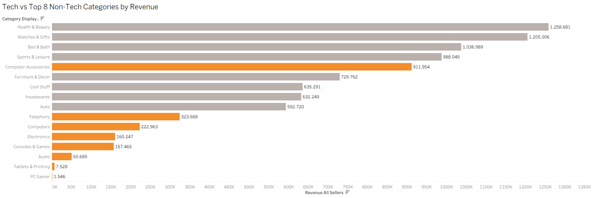

#Eniac-Business Partner Analysis with Magist

##Project Overview

Eniac, a European e-commerce company specialising in tech products, is considering expanding into the Brazilian market.

To enter the market quickly, Eniac is considering a 3-year partnership with Magist, a Brazilian SaaS company providing order management, logistics, shipment and after-sales services.

Before committing to the partnership, Eniac needs to answer two key questions:

1. Is Magist a good fit for Eniacs tech-focused product catalogue?
2. Is Magists delivery performance reliable enough for Eniacs customers?

This project analyses Magists database to assess the market potential and operational risks associated with the partnership.

---

##Business Questions

The analysis focuses on:

- How strong is the market for tech products?
- Are expensive tech products popular?
- How does tech revenue compare with non-tech categories?
- How do tech sellers perform compared with other sellers?
- How long does an order take to reach the customer?
- How many orders are delivered on time?
- How severe are delivery delays?
- Is Magist suitable as a logistics partner for Eniac?

---

##Tools

- MySQL Workbench: data exploration and SQL analysis
- Tableau: data visualisation and dashboards
- GitHub: project documentation

---

##Dataset

The analysis uses a snapshot of Magists Brazilian e-commerce database.

The database contains information about:

- Customers
- Sellers
- Products
- Product categories
- Orders
- Order items
- Payments
- Reviews
- Geographic data

The dataset contains 74 product categories and 25 months of order data.

---

#Key Findings

##Tech Market

Tech products account for approximately 15% of products sold and 14% of total revenue.

While there is a market for tech products, performance varies significantly between categories.

Computer Accessories is the only tech category competing with the top non-tech sellers.

Other tech categories generate less than 50% of the revenue of the 8th-largest non-tech category.

This suggests that Magist's existing customer base may not be an ideal fit for Eniacs entire tech catalogue.

---

##Premium Tech

The analysis shows that expensive products are sold less frequently, including within the Tech category.

This is particularly relevant to Eniac because its catalogue focuses heavily on high-end technology and Apple-compatible accessories.

Therefore, the current market data creates a potential market-fit risk for Eniac.

---

##Recent Tech Performance

Tech products also performed worse than other product categories in recent months.

This makes the current market situation less favourable for a company whose catalogue is 100% tech-focused.

---

##Delivery Performance

Delivery performance is another potential concern.

92% of deliveries arrived on time, while 8% were delayed.

Although the majority of orders arrived within the estimated delivery date, the size of the delays is more concerning.

The analysis shows that the carrier stage can cause substantial delays, with delayed orders experiencing significantly longer delivery times.

For Eniac, where fast delivery is an important part of the customer experience, this represents a potential operational risk.

---

#Main Risks for Eniac

| Risk | Finding |
|---|---|
|Market fit | Magist currently has a limited market for expensive tech products |
|Premium products | Expensive tech products sell considerably less |
|Tech revenue | Tech contributes only 14% of total revenue |
|Category fit | Computer Accessories is the only tech category competing with top non-tech categories |
|Recent performance | Tech products performed worse than other categories in recent months |
|Delivery reliability | 8% of deliveries were delayed |
|Delay severity | Delayed orders can experience substantial additional delivery time |

---

#Tableau Dashboard

The SQL analysis was used to create Tableau visualisations covering:

- Tech vs. Non-Tech revenue
- Revenue by product category
- Expensive vs. non-expensive product sales
- Seller performance
- Delivery processing times
- On-time vs. delayed deliveries
- Recent category performance



---

#Recommendation

### Reassess the partnership opportunity in 6 months.

Based on the research, we do not recommend immediately committing to the full 3-year partnership without further evaluation.

The current data highlights two important concerns:

### 1. Market Fit

Magist does not currently show a large market for expensive tech products, which creates a potential mismatch with Eniac's high-end, tech-focused catalogue.

### 2. Operational Reliability

While 92% of deliveries arrive on time, the 8% that are delayed can experience substantial delays, particularly during the carrier stage.

These risks do not necessarily mean that Eniac should abandon the Brazilian market or Magist as a potential partner.

Instead, we recommend using the next 6 months to monitor:

- Tech category performance
- Demand for higher-priced products
- Recent sales trends
- Delivery reliability
- Severity of delivery delays

After 6 months, Eniac should reassess whether Magist can support its product strategy and customer experience requirements.

---

##Project Structure

```text
├── README.md
├── Magist Analysis.sql
├── Eniac Worksheets.twbx
└── Images/
    └── tech_vs_nontech_revenue.png
